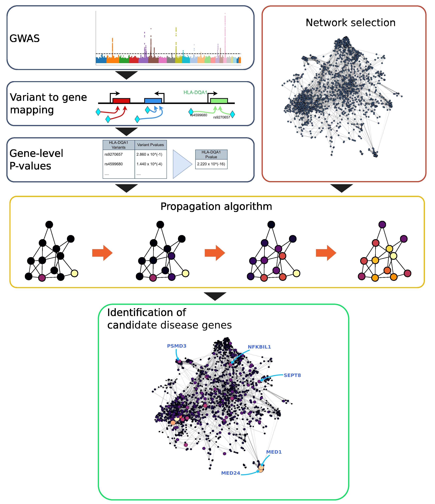

# Network Propagation for GWAS Analysis

This repository contains the code used to generate the results for the paper "Network propagation for GWAS analysis: a practical guide to leveraging molecular networks for disease gene discovery", 
by Giovanni Visonà, Emmanuelle Bouzigon, Florence Demenais, Gabriele Schweikert. 

This project has received funding from the European Union's Framework Programme for Research and Innovation Horizon 2020 (2014-2020) under the Marie Skłodowska-Curie Grant Agreement No. 813533-MSCA-ITN-2018 
